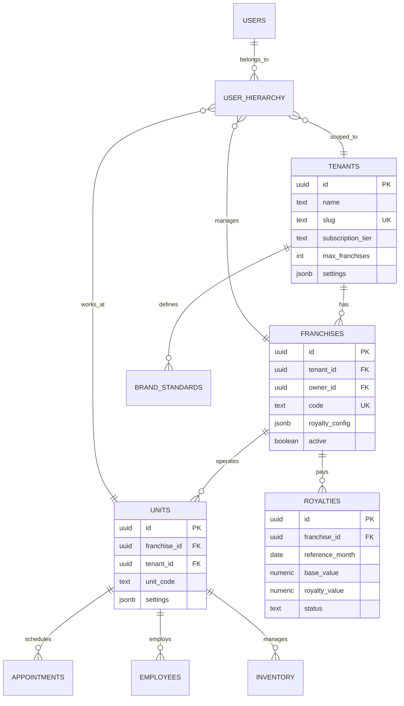

# 🏗️ Arquitetura Técnica Multi-Tenant
## Sistema de Franquias Pet Shop - Especificação Técnica Detalhada

---

## 📐 Visão Geral da Arquitetura

### Stack Tecnológica Completa

```
┌─────────────────── FRONTEND ───────────────────┐
│                                                 │
│  React 18 + TypeScript + Vite                  │
│  ├─ Zustand (State Management)                 │
│  ├─ React Query (Data Fetching & Cache)        │
│  ├─ React Router v6 (Routing)                  │
│  ├─ Tailwind CSS (Styling)                     │
│  ├─ Shadcn/ui (Component Library)              │
│  ├─ Recharts (Data Visualization)              │
│  ├─ Framer Motion (Animations)                 │
│  └─ React Hook Form + Zod (Forms & Validation) │
│                                                 │
└─────────────────────────────────────────────────┘
                        │
                        │ HTTPS
                        ▼
┌─────────────────── API LAYER ──────────────────┐
│                                                 │
│  Supabase Edge Functions (Deno)                │
│  ├─ Authentication & Authorization             │
│  ├─ Multi-tenant Context                       │
│  ├─ Business Logic                             │
│  ├─ Royalty Calculations                       │
│  ├─ Report Generation                          │
│  └─ Webhook Handlers                           │
│                                                 │
└─────────────────────────────────────────────────┘
                        │
                        │ Connection Pooling
                        ▼
┌─────────────────── DATABASE ───────────────────┐
│                                                 │
│  PostgreSQL 15 (Supabase)                      │
│  ├─ Row-Level Security (RLS)                   │
│  ├─ Table Partitioning                         │
│  ├─ Materialized Views                         │
│  ├─ Stored Procedures                          │
│  └─ Full-text Search                           │
│                                                 │
└─────────────────────────────────────────────────┘
                        │
                        │
                        ▼
┌─────────────────── CACHE ──────────────────────┐
│                                                 │
│  Redis (Upstash)                                │
│  ├─ Session Cache                               │
│  ├─ Query Results Cache                         │
│  ├─ Rate Limiting                               │
│  └─ Job Queue (BullMQ)                          │
│                                                 │
└─────────────────────────────────────────────────┘
                        │
                        │
                        ▼
┌─────────────────── STORAGE ────────────────────┐
│                                                 │
│  Supabase Storage                               │
│  ├─ Pet Photos                                  │
│  ├─ Documents                                   │
│  ├─ Brand Assets                                │
│  └─ Reports (PDF)                               │
│                                                 │
└─────────────────────────────────────────────────┘
                        │
                        │
                        ▼
┌─────────────────── OBSERVABILITY ──────────────┐
│                                                 │
│  Monitoring & Logging                           │
│  ├─ Sentry (Error Tracking)                     │
│  ├─ LogRocket (Session Replay)                  │
│  ├─ Vercel Analytics (Web Vitals)               │
│  └─ Custom Dashboards                           │
│                                                 │
└─────────────────────────────────────────────────┘
```

---

## 🗄️ Modelo de Dados Completo

### Diagrama ER Simplificado



### Schema SQL Completo

```sql
-- ==============================================
-- CORE TABLES
-- ==============================================

-- Tenants (Franqueadoras)
CREATE TABLE tenants (
  id uuid PRIMARY KEY DEFAULT gen_random_uuid(),
  name text NOT NULL,
  slug text UNIQUE NOT NULL,
  logo_url text,
  domain text, -- ex: petland.app.com
  subscription_tier text NOT NULL CHECK (subscription_tier IN ('starter', 'professional', 'enterprise')),
  subscription_status text DEFAULT 'active' CHECK (subscription_status IN ('active', 'trial', 'suspended', 'cancelled')),
  max_franchises integer DEFAULT -1, -- -1 = unlimited
  max_units integer DEFAULT -1,
  created_at timestamptz DEFAULT now(),
  updated_at timestamptz DEFAULT now(),
  settings jsonb DEFAULT '{
    "branding": {
      "primary_color": "#3B82F6",
      "logo_url": ""
    },
    "features": {
      "royalties": true,
      "compliance": true,
      "bi_advanced": false
    },
    "notifications": {
      "email": true,
      "sms": false,
      "whatsapp": true
    }
  }'::jsonb
);

-- Franchises (Franquias)
CREATE TABLE franchises (
  id uuid PRIMARY KEY DEFAULT gen_random_uuid(),
  tenant_id uuid NOT NULL REFERENCES tenants(id) ON DELETE CASCADE,
  name text NOT NULL,
  code text UNIQUE NOT NULL, -- PETLAND-SP-001
  owner_id uuid REFERENCES auth.users(id),
  address jsonb DEFAULT '{
    "street": "",
    "number": "",
    "complement": "",
    "neighborhood": "",
    "city": "",
    "state": "",
    "zip_code": "",
    "country": "Brasil"
  }'::jsonb,
  contact jsonb DEFAULT '{
    "email": "",
    "phone": "",
    "whatsapp": ""
  }'::jsonb,
  royalty_config jsonb DEFAULT '{
    "enabled": true,
    "type": "percentage",
    "value": 5.0,
    "base_on": "gross_revenue",
    "frequency": "monthly",
    "due_day": 10,
    "grace_period_days": 5,
    "penalty_rate": 2.0
  }'::jsonb,
  active boolean DEFAULT true,
  created_at timestamptz DEFAULT now(),
  updated_at timestamptz DEFAULT now(),
  UNIQUE(tenant_id, code)
);

-- Units (Unidades - evolução de pet_shops)
ALTER TABLE pet_shops ADD COLUMN IF NOT EXISTS franchise_id uuid REFERENCES franchises(id) ON DELETE SET NULL;
ALTER TABLE pet_shops ADD COLUMN IF NOT EXISTS tenant_id uuid REFERENCES tenants(id) ON DELETE CASCADE;
ALTER TABLE pet_shops ADD COLUMN IF NOT EXISTS unit_code text;
ALTER TABLE pet_shops ADD COLUMN IF NOT EXISTS manager_id uuid REFERENCES auth.users(id);
ALTER TABLE pet_shops ADD COLUMN IF NOT EXISTS settings jsonb DEFAULT '{
  "operating_hours": {},
  "service_radius_km": 5,
  "auto_confirm_appointments": false,
  "notifications": {
    "client_reminders": true,
    "staff_assignments": true
  }
}'::jsonb;

CREATE UNIQUE INDEX IF NOT EXISTS idx_petshops_unit_code ON pet_shops(tenant_id, unit_code) WHERE unit_code IS NOT NULL;

-- Royalties
CREATE TABLE royalties (
  id uuid PRIMARY KEY DEFAULT gen_random_uuid(),
  tenant_id uuid NOT NULL REFERENCES tenants(id) ON DELETE CASCADE,
  franchise_id uuid NOT NULL REFERENCES franchises(id) ON DELETE CASCADE,
  reference_month date NOT NULL, -- primeiro dia do mês de referência
  base_value numeric(12,2) NOT NULL DEFAULT 0, -- faturamento bruto
  deductions numeric(12,2) DEFAULT 0, -- descontos, devoluções, etc
  taxable_value numeric(12,2) NOT NULL DEFAULT 0, -- base - deductions
  royalty_percentage numeric(5,2),
  royalty_value numeric(12,2) NOT NULL DEFAULT 0,
  status text DEFAULT 'pending' CHECK (status IN ('pending', 'processing', 'calculated', 'paid', 'overdue', 'waived')),
  due_date date NOT NULL,
  paid_at timestamptz,
  payment_method text,
  payment_reference text,
  notes text,
  attachments jsonb DEFAULT '[]'::jsonb,
  created_at timestamptz DEFAULT now(),
  updated_at timestamptz DEFAULT now(),
  UNIQUE(franchise_id, reference_month)
);

-- Brand Standards (Padrões da Franqueadora)
CREATE TABLE brand_standards (
  id uuid PRIMARY KEY DEFAULT gen_random_uuid(),
  tenant_id uuid NOT NULL REFERENCES tenants(id) ON DELETE CASCADE,
  category text NOT NULL CHECK (category IN ('service', 'product', 'process', 'quality', 'safety', 'training')),
  title text NOT NULL,
  description text,
  checklist jsonb DEFAULT '[]'::jsonb, -- [{ "id": "...", "item": "...", "mandatory": true, "order": 1 }]
  attachments jsonb DEFAULT '[]'::jsonb, -- [{ "name": "...", "url": "...", "type": "pdf" }]
  applies_to text[] DEFAULT ARRAY['all'], -- ['all', 'franchise:uuid', 'unit:uuid']
  active boolean DEFAULT true,
  version integer DEFAULT 1,
  created_by uuid REFERENCES auth.users(id),
  created_at timestamptz DEFAULT now(),
  updated_at timestamptz DEFAULT now()
);

-- Compliance Audits (Auditorias de Conformidade)
CREATE TABLE compliance_audits (
  id uuid PRIMARY KEY DEFAULT gen_random_uuid(),
  tenant_id uuid NOT NULL REFERENCES tenants(id) ON DELETE CASCADE,
  franchise_id uuid REFERENCES franchises(id) ON DELETE CASCADE,
  unit_id uuid REFERENCES pet_shops(id) ON DELETE CASCADE,
  standard_id uuid NOT NULL REFERENCES brand_standards(id) ON DELETE RESTRICT,
  auditor_id uuid REFERENCES auth.users(id),
  audit_date date NOT NULL DEFAULT CURRENT_DATE,
  score numeric(5,2) CHECK (score >= 0 AND score <= 100),
  max_score numeric(5,2) DEFAULT 100,
  findings jsonb DEFAULT '[]'::jsonb, -- [{ "item_id": "...", "compliant": true, "notes": "...", "photo_url": "" }]
  action_plan text,
  status text DEFAULT 'pending' CHECK (status IN ('pending', 'in_progress', 'resolved', 'escalated')),
  resolved_at timestamptz,
  created_at timestamptz DEFAULT now(),
  updated_at timestamptz DEFAULT now()
);

-- User Hierarchy (Hierarquia Multi-Tenant)
CREATE TABLE user_hierarchy (
  id uuid PRIMARY KEY DEFAULT gen_random_uuid(),
  user_id uuid NOT NULL REFERENCES auth.users(id) ON DELETE CASCADE,
  tenant_id uuid REFERENCES tenants(id) ON DELETE CASCADE,
  franchise_id uuid REFERENCES franchises(id) ON DELETE CASCADE,
  unit_id uuid REFERENCES pet_shops(id) ON DELETE CASCADE,
  role app_role NOT NULL,
  permissions jsonb DEFAULT '{
    "dashboard": ["view"],
    "appointments": ["view", "create", "update"],
    "clients": ["view", "create", "update"],
    "inventory": ["view"],
    "reports": ["view"],
    "settings": []
  }'::jsonb,
  active boolean DEFAULT true,
  created_at timestamptz DEFAULT now(),
  updated_at timestamptz DEFAULT now(),
  UNIQUE(user_id, tenant_id),
  CHECK (
    -- Validação: tenant_admin deve ter tenant_id
    (role = 'tenant_admin' AND tenant_id IS NOT NULL) OR
    -- franchise_owner deve ter franchise_id
    (role = 'franchise_owner' AND franchise_id IS NOT NULL) OR
    -- unit_manager deve ter unit_id
    (role = 'unit_manager' AND unit_id IS NOT NULL) OR
    -- outros roles
    role IN ('professional', 'client', 'admin')
  )
);

-- Stock Transfers (Transferências entre Unidades)
CREATE TABLE stock_transfers (
  id uuid PRIMARY KEY DEFAULT gen_random_uuid(),
  tenant_id uuid NOT NULL REFERENCES tenants(id) ON DELETE CASCADE,
  from_unit_id uuid NOT NULL REFERENCES pet_shops(id) ON DELETE RESTRICT,
  to_unit_id uuid NOT NULL REFERENCES pet_shops(id) ON DELETE RESTRICT,
  product_id uuid NOT NULL REFERENCES products(id) ON DELETE RESTRICT,
  quantity integer NOT NULL CHECK (quantity > 0),
  status text DEFAULT 'pending' CHECK (status IN ('pending', 'approved', 'in_transit', 'received', 'cancelled')),
  requested_by uuid NOT NULL REFERENCES auth.users(id),
  approved_by uuid REFERENCES auth.users(id),
  shipped_at timestamptz,
  received_at timestamptz,
  notes text,
  created_at timestamptz DEFAULT now(),
  updated_at timestamptz DEFAULT now(),
  CHECK (from_unit_id != to_unit_id)
);

-- Insights (BI e ML)
CREATE TABLE insights (
  id uuid PRIMARY KEY DEFAULT gen_random_uuid(),
  tenant_id uuid REFERENCES tenants(id) ON DELETE CASCADE,
  franchise_id uuid REFERENCES franchises(id) ON DELETE CASCADE,
  unit_id uuid REFERENCES pet_shops(id) ON DELETE CASCADE,
  type text NOT NULL CHECK (type IN ('opportunity', 'risk', 'optimization', 'anomaly')),
  category text NOT NULL, -- 'revenue', 'operations', 'inventory', 'staffing', 'quality'
  title text NOT NULL,
  description text NOT NULL,
  impact text NOT NULL CHECK (impact IN ('low', 'medium', 'high', 'critical')),
  confidence numeric(5,2) CHECK (confidence >= 0 AND confidence <= 100), -- confiança da predição (ML)
  data jsonb DEFAULT '{}'::jsonb, -- dados relevantes
  actions jsonb DEFAULT '[]'::jsonb, -- ações sugeridas
  status text DEFAULT 'new' CHECK (status IN ('new', 'viewed', 'acting', 'resolved', 'dismissed')),
  resolved_at timestamptz,
  valid_until date,
  created_at timestamptz DEFAULT now()
);

-- ==============================================
-- ÍNDICES OTIMIZADOS
-- ==============================================

-- Tenants
CREATE INDEX idx_tenants_slug ON tenants(slug);
CREATE INDEX idx_tenants_status ON tenants(subscription_status) WHERE subscription_status = 'active';

-- Franchises
CREATE INDEX idx_franchises_tenant ON franchises(tenant_id, active);
CREATE INDEX idx_franchises_owner ON franchises(owner_id);
CREATE INDEX idx_franchises_code ON franchises(code);

-- Units (pet_shops)
CREATE INDEX idx_units_tenant ON pet_shops(tenant_id, active);
CREATE INDEX idx_units_franchise ON pet_shops(franchise_id, active);
CREATE INDEX idx_units_manager ON pet_shops(manager_id);

-- Royalties
CREATE INDEX idx_royalties_franchise_month ON royalties(franchise_id, reference_month DESC);
CREATE INDEX idx_royalties_tenant_status ON royalties(tenant_id, status);
CREATE INDEX idx_royalties_due_date ON royalties(due_date) WHERE status IN ('pending', 'calculated');

-- Compliance
CREATE INDEX idx_audits_tenant_date ON compliance_audits(tenant_id, audit_date DESC);
CREATE INDEX idx_audits_unit_date ON compliance_audits(unit_id, audit_date DESC);
CREATE INDEX idx_audits_status ON compliance_audits(status) WHERE status != 'resolved';

-- User Hierarchy
CREATE INDEX idx_user_hierarchy_user ON user_hierarchy(user_id, active);
CREATE INDEX idx_user_hierarchy_tenant ON user_hierarchy(tenant_id, role, active);
CREATE INDEX idx_user_hierarchy_franchise ON user_hierarchy(franchise_id, active);
CREATE INDEX idx_user_hierarchy_unit ON user_hierarchy(unit_id, active);

-- Stock Transfers
CREATE INDEX idx_transfers_from_unit ON stock_transfers(from_unit_id, status);
CREATE INDEX idx_transfers_to_unit ON stock_transfers(to_unit_id, status);
CREATE INDEX idx_transfers_pending ON stock_transfers(tenant_id, status) WHERE status IN ('pending', 'approved');

-- Insights
CREATE INDEX idx_insights_tenant_status ON insights(tenant_id, status, created_at DESC);
CREATE INDEX idx_insights_unit_type ON insights(unit_id, type, status);

-- ==============================================
-- RLS POLICIES MULTI-TENANT
-- ==============================================

-- Helper Functions
CREATE OR REPLACE FUNCTION get_current_tenant_id()
RETURNS uuid AS $$
  SELECT COALESCE(
    current_setting('app.current_tenant_id', true)::uuid,
    (SELECT tenant_id FROM user_hierarchy WHERE user_id = auth.uid() AND active = true LIMIT 1)
  );
$$ LANGUAGE sql STABLE SECURITY DEFINER;

CREATE OR REPLACE FUNCTION is_tenant_admin(_tenant_id uuid DEFAULT NULL)
RETURNS boolean AS $$
  SELECT EXISTS (
    SELECT 1 FROM user_hierarchy
    WHERE user_id = auth.uid()
      AND (tenant_id = COALESCE(_tenant_id, get_current_tenant_id()))
      AND role = 'tenant_admin'
      AND active = true
  );
$$ LANGUAGE sql STABLE SECURITY DEFINER;

CREATE OR REPLACE FUNCTION is_franchise_owner(_franchise_id uuid DEFAULT NULL)
RETURNS boolean AS $$
  SELECT EXISTS (
    SELECT 1 FROM user_hierarchy
    WHERE user_id = auth.uid()
      AND (franchise_id = _franchise_id OR _franchise_id IS NULL)
      AND role = 'franchise_owner'
      AND active = true
  );
$$ LANGUAGE sql STABLE SECURITY DEFINER;

-- RLS Policies for Franchises
ALTER TABLE franchises ENABLE ROW LEVEL SECURITY;

CREATE POLICY "tenant_admins_full_access_franchises"
  ON franchises FOR ALL
  USING (is_tenant_admin(tenant_id));

CREATE POLICY "franchise_owners_view_own"
  ON franchises FOR SELECT
  USING (
    EXISTS (
      SELECT 1 FROM user_hierarchy
      WHERE user_id = auth.uid()
        AND franchise_id = franchises.id
        AND active = true
    )
  );

-- RLS Policies for Units
CREATE POLICY "tenant_isolation_units"
  ON pet_shops FOR ALL
  USING (
    tenant_id = get_current_tenant_id()
    OR tenant_id IS NULL -- backwards compatibility
  );

-- RLS Policies for Royalties
ALTER TABLE royalties ENABLE ROW LEVEL SECURITY;

CREATE POLICY "tenant_admins_manage_royalties"
  ON royalties FOR ALL
  USING (is_tenant_admin(tenant_id));

CREATE POLICY "franchise_owners_view_own_royalties"
  ON royalties FOR SELECT
  USING (
    EXISTS (
      SELECT 1 FROM user_hierarchy
      WHERE user_id = auth.uid()
        AND franchise_id = royalties.franchise_id
        AND active = true
    )
  );

-- RLS Policies for Brand Standards
ALTER TABLE brand_standards ENABLE ROW LEVEL SECURITY;

CREATE POLICY "tenant_admins_manage_standards"
  ON brand_standards FOR ALL
  USING (is_tenant_admin(tenant_id));

CREATE POLICY "all_users_view_active_standards"
  ON brand_standards FOR SELECT
  USING (
    active = true 
    AND tenant_id = get_current_tenant_id()
  );

-- ==============================================
-- TRIGGERS
-- ==============================================

-- Auto-update updated_at
CREATE OR REPLACE FUNCTION update_updated_at()
RETURNS TRIGGER AS $$
BEGIN
  NEW.updated_at = now();
  RETURN NEW;
END;
$$ LANGUAGE plpgsql;

CREATE TRIGGER set_updated_at_tenants
  BEFORE UPDATE ON tenants
  FOR EACH ROW EXECUTE FUNCTION update_updated_at();

CREATE TRIGGER set_updated_at_franchises
  BEFORE UPDATE ON franchises
  FOR EACH ROW EXECUTE FUNCTION update_updated_at();

CREATE TRIGGER set_updated_at_royalties
  BEFORE UPDATE ON royalties
  FOR EACH ROW EXECUTE FUNCTION update_updated_at();

-- Auto-calculate taxable_value for royalties
CREATE OR REPLACE FUNCTION calculate_taxable_value()
RETURNS TRIGGER AS $$
BEGIN
  NEW.taxable_value = NEW.base_value - COALESCE(NEW.deductions, 0);
  RETURN NEW;
END;
$$ LANGUAGE plpgsql;

CREATE TRIGGER calculate_royalty_taxable
  BEFORE INSERT OR UPDATE OF base_value, deductions ON royalties
  FOR EACH ROW EXECUTE FUNCTION calculate_taxable_value();

-- ==============================================
-- STORED PROCEDURES
-- ==============================================

-- Gerar código de franquia
CREATE OR REPLACE FUNCTION generate_franchise_code(
  _tenant_id uuid,
  _state_code text DEFAULT NULL
)
RETURNS text AS $$
DECLARE
  tenant_slug text;
  next_number integer;
  new_code text;
BEGIN
  -- Buscar slug do tenant
  SELECT slug INTO tenant_slug FROM tenants WHERE id = _tenant_id;
  
  -- Contar franchises existentes
  SELECT COUNT(*) + 1 INTO next_number
  FROM franchises
  WHERE tenant_id = _tenant_id;
  
  -- Gerar código: PETLAND-SP-001
  new_code := UPPER(tenant_slug) || 
              COALESCE('-' || UPPER(_state_code), '') || 
              '-' || LPAD(next_number::text, 3, '0');
  
  RETURN new_code;
END;
$$ LANGUAGE plpgsql SECURITY DEFINER;

-- Calcular royalties do mês
CREATE OR REPLACE FUNCTION calculate_monthly_royalties(
  _tenant_id uuid,
  _reference_month date
)
RETURNS void AS $$
DECLARE
  franchise_record RECORD;
  revenue numeric;
  royalty_amount numeric;
BEGIN
  FOR franchise_record IN
    SELECT * FROM franchises
    WHERE tenant_id = _tenant_id
      AND active = true
      AND (royalty_config->>'enabled')::boolean = true
  LOOP
    -- Calcular faturamento do mês
    SELECT COALESCE(SUM(s.price), 0) INTO revenue
    FROM appointments a
    JOIN services s ON s.id = a.service_id
    WHERE a.franchise_id = franchise_record.id
      AND a.status = 'completed'
      AND date_trunc('month', a.scheduled_date) = date_trunc('month', _reference_month);
    
    -- Calcular royalty baseado na config
    IF (franchise_record.royalty_config->>'type') = 'percentage' THEN
      royalty_amount := revenue * (franchise_record.royalty_config->>'value')::numeric / 100;
    ELSIF (franchise_record.royalty_config->>'type') = 'fixed' THEN
      royalty_amount := (franchise_record.royalty_config->>'value')::numeric;
    END IF;
    
    -- Inserir ou atualizar royalty
    INSERT INTO royalties (
      tenant_id,
      franchise_id,
      reference_month,
      base_value,
      royalty_percentage,
      royalty_value,
      due_date,
      status
    ) VALUES (
      _tenant_id,
      franchise_record.id,
      _reference_month,
      revenue,
      (franchise_record.royalty_config->>'value')::numeric,
      royalty_amount,
      (_reference_month + INTERVAL '1 month' + 
       ((franchise_record.royalty_config->>'due_day')::integer || ' days')::interval)::date,
      'calculated'
    )
    ON CONFLICT (franchise_id, reference_month)
    DO UPDATE SET
      base_value = EXCLUDED.base_value,
      royalty_value = EXCLUDED.royalty_value,
      status = 'calculated',
      updated_at = now();
  END LOOP;
END;
$$ LANGUAGE plpgsql SECURITY DEFINER;
```

---

## 🔐 Autenticação e Autorização

### Context Provider Multi-Tenant

```typescript
// lib/tenant-context.ts
import { createContext, useContext, useEffect, useState } from 'react';
import { supabase } from '@/integrations/supabase/client';

interface TenantContextType {
  tenantId: string | null;
  tenant: Tenant | null;
  setCurrentTenant: (id: string) => Promise<void>;
  userRole: AppRole | null;
  permissions: Permissions;
}

const TenantContext = createContext<TenantContextType | undefined>(undefined);

export const TenantProvider = ({ children }: { children: React.ReactNode }) => {
  const [tenantId, setTenantId] = useState<string | null>(null);
  const [tenant, setTenant] = useState<Tenant | null>(null);
  const [userRole, setUserRole] = useState<AppRole | null>(null);
  const [permissions, setPermissions] = useState<Permissions>({});
  
  useEffect(() => {
    loadUserContext();
  }, []);
  
  const loadUserContext = async () => {
    const { data: { user } } = await supabase.auth.getUser();
    
    if (!user) return;
    
    // Buscar hierarquia do usuário
    const { data: hierarchy } = await supabase
      .from('user_hierarchy')
      .select('*, tenants(*)')
      .eq('user_id', user.id)
      .eq('active', true)
      .single();
    
    if (hierarchy) {
      setTenantId(hierarchy.tenant_id);
      setTenant(hierarchy.tenants);
      setUserRole(hierarchy.role);
      setPermissions(hierarchy.permissions);
      
      // Configurar tenant no contexto do Supabase
      await supabase.rpc('set_current_tenant', { 
        _tenant_id: hierarchy.tenant_id 
      });
    }
  };
  
  const setCurrentTenant = async (id: string) => {
    // Verificar se usuário tem acesso a esse tenant
    const { data } = await supabase
      .from('user_hierarchy')
      .select('*, tenants(*)')
      .eq('tenant_id', id)
      .eq('active', true)
      .single();
    
    if (data) {
      setTenantId(id);
      setTenant(data.tenants);
      await supabase.rpc('set_current_tenant', { _tenant_id: id });
    }
  };
  
  return (
    <TenantContext.Provider value={{
      tenantId,
      tenant,
      setCurrentTenant,
      userRole,
      permissions,
    }}>
      {children}
    </TenantContext.Provider>
  );
};

export const useTenant = () => {
  const context = useContext(TenantContext);
  if (!context) throw new Error('useTenant must be used within TenantProvider');
  return context;
};
```

### RBAC (Role-Based Access Control)

```typescript
// lib/rbac.ts
type Permission = 'view' | 'create' | 'update' | 'delete' | 'manage';
type Resource = 'dashboard' | 'appointments' | 'clients' | 'employees' | 
                'inventory' | 'reports' | 'settings' | 'franchises' | 
                'royalties' | 'compliance';

const ROLE_PERMISSIONS: Record<AppRole, Record<Resource, Permission[]>> = {
  admin: {
    // Acesso total
    dashboard: ['view', 'manage'],
    appointments: ['view', 'create', 'update', 'delete', 'manage'],
    clients: ['view', 'create', 'update', 'delete', 'manage'],
    employees: ['view', 'create', 'update', 'delete', 'manage'],
    inventory: ['view', 'create', 'update', 'delete', 'manage'],
    reports: ['view', 'manage'],
    settings: ['view', 'update', 'manage'],
    franchises: ['view', 'create', 'update', 'delete', 'manage'],
    royalties: ['view', 'create', 'update', 'delete', 'manage'],
    compliance: ['view', 'create', 'update', 'delete', 'manage'],
  },
  
  tenant_admin: {
    // Admin da franqueadora
    dashboard: ['view', 'manage'],
    appointments: ['view'],
    clients: ['view'],
    employees: ['view'],
    inventory: ['view'],
    reports: ['view', 'manage'],
    settings: ['view', 'update'],
    franchises: ['view', 'create', 'update', 'manage'],
    royalties: ['view', 'create', 'update', 'manage'],
    compliance: ['view', 'create', 'update', 'manage'],
  },
  
  franchise_owner: {
    // Dono da franquia
    dashboard: ['view'],
    appointments: ['view', 'update'],
    clients: ['view', 'update'],
    employees: ['view', 'create', 'update'],
    inventory: ['view', 'update'],
    reports: ['view'],
    settings: ['view', 'update'],
    franchises: [], // não pode gerenciar franchises
    royalties: ['view'], // apenas visualiza seus royalties
    compliance: ['view'],
  },
  
  unit_manager: {
    // Gerente de unidade
    dashboard: ['view'],
    appointments: ['view', 'create', 'update'],
    clients: ['view', 'create', 'update'],
    employees: ['view', 'update'],
    inventory: ['view', 'update'],
    reports: ['view'],
    settings: ['view'],
    franchises: [],
    royalties: [],
    compliance: ['view'],
  },
  
  professional: {
    // Funcionário
    dashboard: ['view'],
    appointments: ['view', 'create', 'update'],
    clients: ['view', 'update'],
    employees: [],
    inventory: ['view', 'update'],
    reports: ['view'],
    settings: [],
    franchises: [],
    royalties: [],
    compliance: ['view'],
  },
  
  client: {
    // Cliente
    dashboard: ['view'],
    appointments: ['view', 'create', 'update'],
    clients: [], // apenas os próprios dados
    employees: [],
    inventory: [],
    reports: [],
    settings: ['view', 'update'], // apenas configurações próprias
    franchises: [],
    royalties: [],
    compliance: [],
  },
};

export const can = (
  role: AppRole,
  resource: Resource,
  permission: Permission
): boolean => {
  const permissions = ROLE_PERMISSIONS[role]?.[resource] || [];
  return permissions.includes(permission) || permissions.includes('manage');
};

// Hook para usar no frontend
export const usePermissions = () => {
  const { userRole } = useTenant();
  
  return {
    can: (resource: Resource, permission: Permission) => 
      userRole ? can(userRole, resource, permission) : false,
  };
};

// Componente de proteção
export const ProtectedAction = ({ 
  resource, 
  permission, 
  children,
  fallback = null 
}: { 
  resource: Resource; 
  permission: Permission; 
  children: React.ReactNode;
  fallback?: React.ReactNode;
}) => {
  const { can: canPerform } = usePermissions();
  
  return canPerform(resource, permission) ? <>{children}</> : <>{fallback}</>;
};
```

---

## 🚀 Performance e Escalabilidade

### Estratégia de Cache

```typescript
// lib/cache-strategy.ts
import { QueryClient } from '@tanstack/react-query';

export const queryClient = new QueryClient({
  defaultOptions: {
    queries: {
      staleTime: 5 * 60 * 1000, // 5 minutos
      cacheTime: 10 * 60 * 1000, // 10 minutos
      refetchOnWindowFocus: false,
      retry: 1,
    },
  },
});

// Cache keys estruturados
export const cacheKeys = {
  tenant: (id: string) => ['tenant', id],
  tenantMetrics: (id: string, dateRange: DateRange) => 
    ['tenant-metrics', id, dateRange],
  franchise: (id: string) => ['franchise', id],
  franchises: (tenantId: string) => ['franchises', tenantId],
  units: (franchiseId: string) => ['units', franchiseId],
  royalties: (franchiseId: string, month: string) => 
    ['royalties', franchiseId, month],
};

// Prefetch de dados críticos
export const prefetchDashboardData = async (tenantId: string) => {
  await queryClient.prefetchQuery({
    queryKey: cacheKeys.tenantMetrics(tenantId, getLastMonth()),
    queryFn: () => fetchTenantMetrics(tenantId),
  });
};
```

### Database Connection Pooling

```typescript
// Edge Function com pooling otimizado
import { createClient } from '@supabase/supabase-js';

const supabase = createClient(
  Deno.env.get('SUPABASE_URL')!,
  Deno.env.get('SUPABASE_SERVICE_ROLE_KEY')!,
  {
    db: {
      schema: 'public',
    },
    auth: {
      autoRefreshToken: false,
      persistSession: false,
    },
    global: {
      headers: {
        'x-connection-pool': 'dedicated', // Pool dedicado
      },
    },
  }
);
```

---

Continua em `IMPLEMENTACAO_FRONTEND.md`...
