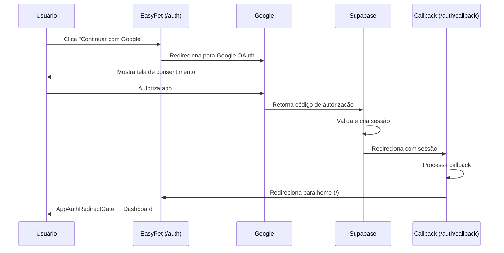

# 🔐 Configuração do Google OAuth - EasyPet

## ✅ Código Corrigido

Todos os problemas de código foram corrigidos:

1. ✅ Rota do callback alinhada: `/auth/callback`
2. ✅ Tratamento robusto de erros implementado
3. ✅ Validações de sessão adicionadas
4. ✅ Mensagens de erro melhoradas

---

## ⚙️ Configuração Necessária no Lovable Cloud

Para o Google OAuth funcionar, você precisa configurar no **Lovable Cloud**:

### 1. Acesse o Backend
- Abra o dashboard do Lovable Cloud
- Vá em **Users → Auth Settings → Google Settings**

### 2. Habilite o Google Provider
- Marque a opção "Enable Google Sign In"

### 3. Configure as Credenciais do Google Cloud

Você precisa criar um projeto no Google Cloud Console e obter:
- **Client ID** (público)
- **Client Secret** (privado)

#### Passos no Google Cloud Console:

1. **Acesse:** https://console.cloud.google.com
2. **Crie um projeto** (ou use um existente)
3. **Habilite a Google+ API:**
   - APIs & Services → Enable APIs and Services
   - Busque "Google+ API" e habilite

4. **Crie as credenciais OAuth:**
   - APIs & Services → Credentials
   - Create Credentials → OAuth client ID
   - Application type: **Web application**

5. **Configure os Redirect URIs:**
   
   Adicione TODAS estas URLs:
   ```
   https://zxdbsimthnfprrthszoh.supabase.co/auth/v1/callback
   https://seu-dominio-lovable.app/auth/callback
   http://localhost:5173/auth/callback (para desenvolvimento)
   ```

6. **Configure Authorized JavaScript origins:**
   ```
   https://zxdbsimthnfprrthszoh.supabase.co
   https://seu-dominio-lovable.app
   http://localhost:5173
   ```

7. **Copie o Client ID e Client Secret**

### 4. Configure no Lovable Cloud

Volte ao Lovable Cloud e insira:
- **Client ID:** `cole aqui o ID do Google`
- **Client Secret:** `cole aqui o Secret do Google`

### 5. Configure a Tela de Consentimento OAuth

No Google Cloud Console:
- OAuth consent screen
- User Type: **External** (para permitir qualquer usuário)
- Preencha as informações básicas:
  - Nome do app: "EasyPet"
  - Email de suporte
  - Logo (opcional)
  - Domínios autorizados: adicione seu domínio

---

## 🧪 Como Testar

1. **Acesse a página de login:** `/auth`
2. **Clique em "Continuar com Google"**
3. **Selecione sua conta Google**
4. **Autorize o app**
5. **Você será redirecionado para:** `/auth/callback` → `/` → dashboard apropriado

---

## 🐛 Troubleshooting

### Erro: "redirect_uri_mismatch"
**Causa:** O redirect URI não está configurado no Google Cloud Console  
**Solução:** Adicione exatamente: `https://zxdbsimthnfprrthszoh.supabase.co/auth/v1/callback`

### Erro: "invalid_client"
**Causa:** Client ID ou Secret incorretos  
**Solução:** Verifique e copie novamente do Google Cloud Console

### Erro: "access_denied"
**Causa:** Usuário cancelou ou app não aprovado  
**Solução:** Certifique-se de que a tela de consentimento está configurada

### Botão não funciona
**Causa:** Google OAuth não habilitado no Supabase  
**Solução:** Habilite em Auth Settings → Google Provider

---

## 📊 Fluxo Completo



---

## ✅ Checklist de Configuração

- [ ] Projeto criado no Google Cloud Console
- [ ] Google+ API habilitada
- [ ] OAuth Client ID criado (Web application)
- [ ] Redirect URIs configurados corretamente
- [ ] JavaScript origins configurados
- [ ] Tela de consentimento OAuth configurada
- [ ] Client ID copiado
- [ ] Client Secret copiado
- [ ] Google Provider habilitado no Lovable Cloud
- [ ] Credenciais inseridas no Lovable Cloud
- [ ] Testado o login

---

## 📝 Notas Importantes

1. **URLs devem ser EXATAS** - sem barra final extra
2. **HTTPS é obrigatório** em produção
3. **Localhost é permitido** apenas para desenvolvimento
4. **Pode levar até 5 minutos** para as mudanças no Google propagarem
5. **Verifique os logs** no console do navegador se houver erros

---

## 🔗 Links Úteis

- [Google Cloud Console](https://console.cloud.google.com)
- [Supabase Auth Docs](https://supabase.com/docs/guides/auth/social-login/auth-google)
- [Lovable Cloud Dashboard](https://lovable.dev)

---

**Status Atual:** ✅ Código 100% implementado e corrigido. Apenas configuração pendente no Lovable Cloud.
