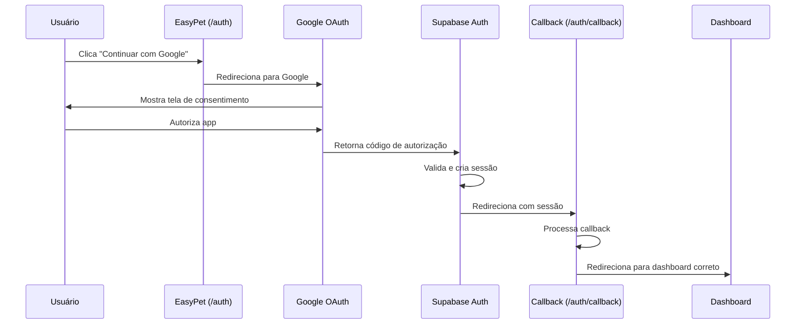

# 🔐 Configuração do Google OAuth - EasyPet

## ✅ Status Atual

O código do Google OAuth está **100% implementado e funcionando**. O que falta é apenas a **configuração manual** das credenciais no Google Cloud Console e no Backend do Lovable Cloud.

---

## 📋 Passo a Passo para Configurar

### **Etapa 1: Criar Projeto no Google Cloud Console**

1. **Acesse:** https://console.cloud.google.com
2. **Crie um novo projeto**:
   - Clique em "Select a project" no topo
   - Clique em "NEW PROJECT"
   - Nome: "EasyPet Auth"
   - Clique em "Create"

### **Etapa 2: Habilitar APIs Necessárias**

1. No menu lateral, vá em **APIs & Services → Library**
2. Busque por "**Google+ API**" e clique em "Enable"
3. Busque por "**OAuth 2.0**" e certifique-se de que está habilitado

### **Etapa 3: Configurar Tela de Consentimento OAuth**

1. Vá em **APIs & Services → OAuth consent screen**
2. Escolha **External** (para permitir qualquer usuário Gmail)
3. Preencha as informações:
   - **App name:** EasyPet
   - **User support email:** seu-email@gmail.com
   - **App logo:** (opcional) - faça upload do logo do EasyPet
   - **Application home page:** URL do seu app
   - **Authorized domains:** 
     - `lovable.app`
     - `supabase.co`
     - Seu domínio personalizado (se tiver)
   - **Developer contact email:** seu-email@gmail.com
4. Clique em **SAVE AND CONTINUE**
5. Em **Scopes**, clique em **ADD OR REMOVE SCOPES** e selecione:
   - `.../auth/userinfo.email`
   - `.../auth/userinfo.profile`
   - `openid`
6. Clique em **SAVE AND CONTINUE**
7. Em **Test users**, adicione pelo menos um email para testes
8. Clique em **SAVE AND CONTINUE** e depois **BACK TO DASHBOARD**

### **Etapa 4: Criar Credenciais OAuth 2.0**

1. Vá em **APIs & Services → Credentials**
2. Clique em **CREATE CREDENTIALS → OAuth client ID**
3. Escolha **Web application**
4. Configure:
   - **Name:** EasyPet Web Client
   
   **Authorized JavaScript origins:**
   ```
   https://xkfkrdorghyagtwbxory.supabase.co
   https://seu-dominio-lovable.app
   http://localhost:5173
   ```
   
   **Authorized redirect URIs:**
   ```
   https://xkfkrdorghyagtwbxory.supabase.co/auth/v1/callback
   https://seu-dominio-lovable.app/auth/callback
   http://localhost:5173/auth/callback
   ```
   
5. Clique em **CREATE**
6. **COPIE** o **Client ID** e **Client Secret** que aparecerem na tela
   - ⚠️ **IMPORTANTE:** Salve esses valores em um local seguro!

### **Etapa 5: Configurar no Backend do Lovable Cloud**

1. **Abra o Backend** do seu projeto Lovable
2. Vá em **Users → Auth Settings → Google Settings**
3. **Habilite** a opção "Enable Google Sign In"
4. **Cole** o **Client ID** no campo correspondente
5. **Cole** o **Client Secret** no campo correspondente
6. Clique em **Save**

---

## 🧪 Como Testar

### Teste 1: Novo Registro com Google
1. Acesse `/auth` no seu app
2. Clique em "Continuar com Google"
3. Selecione sua conta Google
4. Autorize o app
5. ✅ Você deve ser redirecionado para o dashboard apropriado

### Teste 2: Login com Conta Google Existente
1. Faça logout
2. Acesse `/auth`
3. Clique em "Continuar com Google"
4. Selecione a mesma conta Google
5. ✅ Você deve fazer login automaticamente

### Teste 3: Vincular Conta Google a Usuário Existente
1. Crie uma conta com email/senha primeiro
2. Faça login
3. No futuro, ao fazer login com Google usando o mesmo email, as contas serão vinculadas automaticamente

---

## ⚠️ Problemas Comuns

### Erro: "redirect_uri_mismatch"
**Causa:** O redirect URI não está configurado corretamente no Google Cloud Console  
**Solução:** 
1. Verifique se você adicionou EXATAMENTE este URI:
   ```
   https://xkfkrdorghyagtwbxory.supabase.co/auth/v1/callback
   ```
2. Não adicione barra `/` no final
3. Aguarde até 5 minutos para propagar

### Erro: "invalid_client"
**Causa:** Client ID ou Secret incorretos  
**Solução:** 
1. Copie novamente do Google Cloud Console
2. Cole no Backend do Lovable Cloud
3. Clique em "Save"

### Erro: "access_denied"
**Causa:** Usuário cancelou ou app não está aprovado  
**Solução:** 
1. Certifique-se de que a tela de consentimento está configurada como **External**
2. Adicione seu email em **Test users** durante o desenvolvimento
3. Quando estiver pronto para produção, submeta o app para revisão do Google

### Botão do Google não aparece
**Causa:** Google OAuth não habilitado no Backend  
**Solução:** 
1. Abra o Backend
2. Vá em **Users → Auth Settings → Google Settings**
3. Marque a opção "Enable Google Sign In"

---

## 📊 Fluxo Completo



---

## ✅ Checklist Final

- [ ] Projeto criado no Google Cloud Console
- [ ] Google+ API habilitada
- [ ] OAuth Client ID criado (Web application)
- [ ] Redirect URIs configurados corretamente
- [ ] JavaScript origins configurados
- [ ] Tela de consentimento OAuth configurada (External)
- [ ] Client ID copiado
- [ ] Client Secret copiado
- [ ] Google Provider habilitado no Backend
- [ ] Credenciais inseridas no Backend
- [ ] Testado o login com sucesso

---

## 🔗 Links Úteis

- [Google Cloud Console](https://console.cloud.google.com)
- [Supabase Auth Docs](https://supabase.com/docs/guides/auth/social-login/auth-google)
- [OAuth 2.0 Playground](https://developers.google.com/oauthplayground/)

---

**Status:** ✅ Código 100% implementado. Aguardando apenas configuração manual das credenciais.
