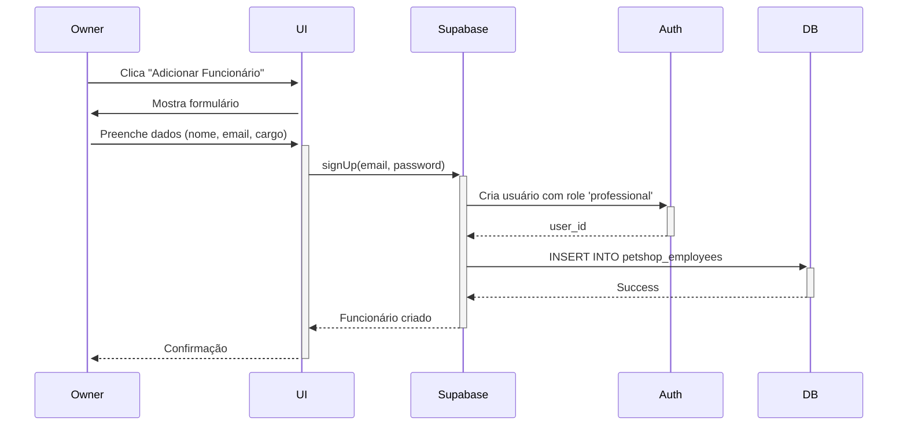
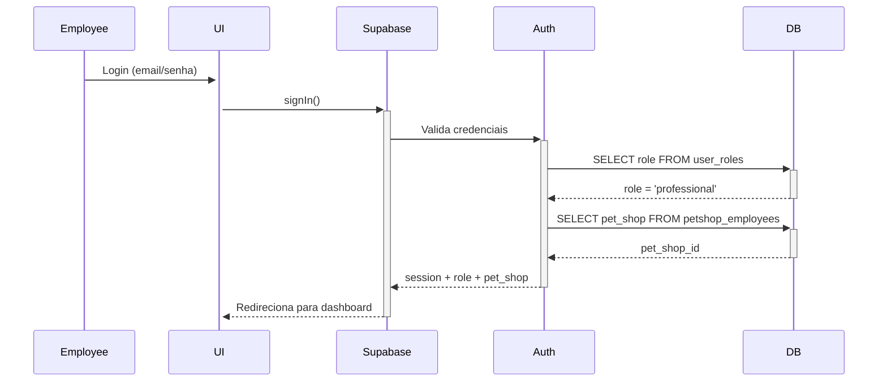

# 🔐 Sistema de Permissões para Profissionais

## 📋 Visão Geral

Sistema de controle de acesso baseado em roles (papéis) que permite aos donos de pet shops adicionar funcionários com permissões específicas para gerenciar diferentes áreas do sistema.

---

## 🎭 Roles (Papéis) Disponíveis

### 1. **Admin** 
- Acesso total ao sistema
- Gerencia todos os pet shops
- Pode criar service templates

### 2. **Pet Shop Owner** (Dono)
- Gerencia seu próprio pet shop
- Adiciona/remove funcionários
- Acesso completo às funcionalidades do pet shop

### 3. **Professional** (Funcionário) ⭐ NOVO
- Vinculado a um pet shop específico
- Permissões limitadas conforme configuração
- Não pode gerenciar outros funcionários

### 4. **Client** (Cliente)
- Agenda serviços
- Gerencia seus pets
- Visualiza histórico

---

## 🔧 Estrutura do Banco de Dados

### Tabela `petshop_employees`

```sql
CREATE TABLE petshop_employees (
  id uuid PRIMARY KEY,
  pet_shop_id uuid REFERENCES pet_shops(id),
  user_id uuid REFERENCES auth.users(id),
  position text, -- Cargo do funcionário
  hired_at date,
  active boolean DEFAULT true,
  created_at timestamptz,
  updated_at timestamptz,
  UNIQUE(pet_shop_id, user_id)
);
```

### Cargos Disponíveis

```typescript
const positions = {
  attendant: "Atendente",
  groomer: "Tosador(a)",
  veterinarian: "Veterinário(a)",
  bather: "Banhista",
  manager: "Gerente"
};
```

---

## ✅ Permissões dos Funcionários

### O que PODEM fazer:

#### 1. **Agendamentos** (`appointments`)
- ✅ Visualizar todos os agendamentos do pet shop
- ✅ Confirmar agendamentos (pending → confirmed)
- ✅ Iniciar atendimento (confirmed → in_progress)
- ✅ Concluir atendimento (in_progress → completed)
- ✅ Cancelar agendamentos

**Policy RLS:**
```sql
CREATE POLICY "Pet shops and professionals can view appointments"
  ON appointments FOR SELECT
  USING (
    is_employee_of_petshop(auth.uid(), pet_shop_id)
  );
```

#### 2. **Serviços** (`services`)
- ✅ Criar novos serviços
- ✅ Editar preços
- ✅ Alterar duração
- ✅ Ativar/desativar serviços

#### 3. **Horários** (`shop_schedule`)
- ✅ Configurar horários de funcionamento
- ✅ Bloquear horários específicos
- ✅ Adicionar exceções (feriados, etc)

#### 4. **Estoque** (`products`, `stock_movements`)
- ✅ Adicionar produtos
- ✅ Editar informações de produtos
- ✅ Registrar entrada/saída de estoque
- ✅ Visualizar alertas de estoque baixo

#### 5. **Financeiro** (`payments`)
- ✅ Visualizar transações
- ✅ Registrar pagamentos
- ✅ Atualizar status de pagamentos
- ✅ Gerar relatórios financeiros

### O que NÃO PODEM fazer:

#### ❌ Restrições de Segurança

1. **Pet Shop**
   - ❌ Editar dados do pet shop (nome, logo, endereço)
   - ❌ Excluir o pet shop
   - ❌ Alterar dono do pet shop

2. **Funcionários**
   - ❌ Adicionar novos funcionários
   - ❌ Remover funcionários
   - ❌ Editar permissões de outros funcionários
   - ❌ Visualizar lista de funcionários

3. **Clientes**
   - ❌ Excluir clientes
   - ❌ Editar dados pessoais dos clientes
   - ❌ Visualizar pets de outros pet shops

---

## 🔍 Funções Helper

### `is_employee_of_petshop(user_id, pet_shop_id)`

Verifica se um usuário é funcionário ativo de um pet shop.

```sql
CREATE FUNCTION is_employee_of_petshop(_user_id uuid, _pet_shop_id uuid)
RETURNS boolean AS $$
  SELECT EXISTS (
    SELECT 1 FROM petshop_employees
    WHERE user_id = _user_id
      AND pet_shop_id = _pet_shop_id
      AND active = true
  );
$$;
```

**Uso nas Policies:**
```sql
USING (
  is_employee_of_petshop(auth.uid(), pet_shop_id)
  OR has_role(auth.uid(), 'admin')
)
```

---

## 📊 Fluxo de Adição de Funcionário

### 1. Dono do Pet Shop



### 2. Funcionário Logando



---

## 🛡️ Segurança

### Row Level Security (RLS)

Todas as tabelas têm RLS ativado com políticas que verificam:

1. **Autenticação**: `auth.uid()` não é null
2. **Ownership**: Dono do pet shop OU funcionário vinculado
3. **Status**: Funcionário está ativo (`active = true`)

### Exemplo Completo de Policy

```sql
-- Funcionários podem gerenciar produtos do seu pet shop
CREATE POLICY "professionals_manage_products"
  ON products FOR ALL
  USING (
    -- É o dono
    EXISTS (
      SELECT 1 FROM pet_shops
      WHERE pet_shops.id = products.pet_shop_id
      AND pet_shops.owner_id = auth.uid()
    )
    -- OU é funcionário ativo
    OR is_employee_of_petshop(auth.uid(), products.pet_shop_id)
  );
```

---

## 🎨 Interface de Gerenciamento

### `/petshop-dashboard/funcionarios`

**Recursos:**
- 📋 Lista de todos os funcionários
- ➕ Adicionar novo funcionário
- ✏️ Ativar/desativar funcionário
- 🗑️ Remover funcionário
- 📊 Ver permissões detalhadas

**Cards de Funcionários:**
```typescript
interface EmployeeCard {
  name: string;
  position: "attendant" | "groomer" | "veterinarian" | "bather" | "manager";
  hired_at: Date;
  active: boolean;
  phone?: string;
}
```

---

## 📱 Como Usar

### Para Donos de Pet Shop:

1. **Adicionar Funcionário**
   ```
   Menu → Funcionários → Adicionar Funcionário
   Preencher: Nome, Email, Telefone, Cargo, Senha
   ```

2. **Desativar Temporariamente**
   ```
   Card do Funcionário → Botão ✓ → Alterna para ✗
   (Funcionário mantém conta mas perde acesso)
   ```

3. **Remover Permanentemente**
   ```
   Card do Funcionário → Botão 🗑️ → Confirmar
   (Remove vínculo mas mantém conta do usuário)
   ```

### Para Funcionários:

1. **Primeiro Login**
   ```
   Receber email/senha do dono
   Fazer login em /auth
   Sistema detecta role 'professional'
   Redireciona para dashboard do pet shop
   ```

2. **Trocar Senha**
   ```
   Primeiro acesso → Alterar senha
   Configurações → Segurança → Nova Senha
   ```

---

## 🔍 Logs e Auditoria

### Recomendações de Monitoramento:

```sql
-- Criar tabela de audit logs
CREATE TABLE employee_actions (
  id uuid PRIMARY KEY,
  employee_id uuid REFERENCES petshop_employees(id),
  action text,
  table_name text,
  record_id uuid,
  timestamp timestamptz DEFAULT now()
);

-- Trigger para registrar ações importantes
CREATE TRIGGER log_employee_actions
  AFTER INSERT OR UPDATE OR DELETE ON appointments
  FOR EACH ROW
  WHEN (is_employee_of_petshop(auth.uid(), NEW.pet_shop_id))
  EXECUTE FUNCTION log_action();
```

---

## 🚀 Próximas Melhorias

### Em Desenvolvimento:
- [ ] Permissões granulares por cargo
- [ ] Histórico de ações por funcionário
- [ ] Relatório de performance individual
- [ ] Comissões automáticas por serviço

### Futuro:
- [ ] Multi-fator de autenticação (MFA)
- [ ] Horários de trabalho por funcionário
- [ ] Integração com ponto eletrônico
- [ ] Dashboard específico para funcionários

---

## 📞 Suporte

### Problemas Comuns:

**1. Funcionário não consegue fazer login**
- ✅ Verificar se está ativo (`active = true`)
- ✅ Confirmar que role é 'professional'
- ✅ Checar vínculo na tabela `petshop_employees`

**2. Acesso negado ao tentar editar**
- ✅ Verificar RLS policies
- ✅ Confirmar que `pet_shop_id` está correto
- ✅ Testar com `SELECT is_employee_of_petshop(...)`

**3. Funcionário vê dados de outro pet shop**
- 🚨 PROBLEMA DE SEGURANÇA
- ✅ Revisar policies RLS
- ✅ Verificar query builders no frontend

---

## 📚 Documentação Técnica

### Arquivos Relevantes:

```
src/
├── pages/
│   └── petshop/
│       └── Funcionarios.tsx       # Interface de gerenciamento
├── components/
│   └── PetShopSidebar.tsx         # Menu com link
└── hooks/
    └── useAuth.tsx                # Gestão de auth

supabase/
└── migrations/
    └── [timestamp]_employees.sql  # Estrutura DB + RLS
```

### Queries Úteis:

```sql
-- Ver todos os funcionários de um pet shop
SELECT 
  pe.*,
  p.full_name,
  p.phone,
  ur.role
FROM petshop_employees pe
JOIN profiles p ON p.id = pe.user_id
JOIN user_roles ur ON ur.user_id = pe.user_id
WHERE pe.pet_shop_id = 'uuid-do-petshop';

-- Verificar permissões de um usuário
SELECT 
  ps.name as pet_shop,
  pe.position,
  pe.active,
  ur.role
FROM petshop_employees pe
JOIN pet_shops ps ON ps.id = pe.pet_shop_id
JOIN user_roles ur ON ur.user_id = pe.user_id
WHERE pe.user_id = 'uuid-do-usuario';
```

---

## ✅ Checklist de Implementação

- [x] Criar enum de roles com 'professional'
- [x] Criar tabela `petshop_employees`
- [x] Implementar função `is_employee_of_petshop()`
- [x] Atualizar policies de todas as tabelas
- [x] Criar interface de gerenciamento
- [x] Adicionar rota ao sidebar
- [x] Testar fluxo completo de adição
- [x] Documentar sistema de permissões
- [ ] Testes de segurança (penetration testing)
- [ ] Treinamento para usuários finais

---

*Documento técnico - Última atualização: 2025-10-31*
